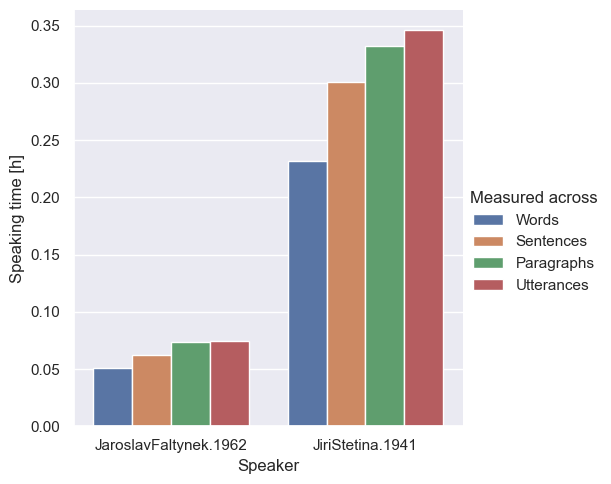
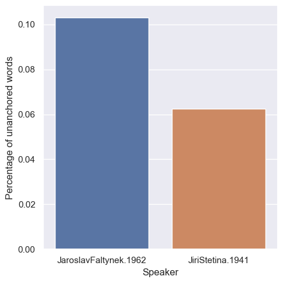

### Total speaking time

Total time the selected members of parliament spent speaking in the parliament according to the available data. The time can be measured several ways - per word, sentence, paragraph or whole utterance.

#### Regular

The time these members of parliament spent speaking in the _regular_ role.

### Relative difference

As different ways of measuring how long the members of parliament spoke lead to different results, we might wish to explore how big those differences are. We will look at the relative difference between such results, i.e. the difference scaled between zero and one.

#### Regular

The relative difference between results computed across data where the members of parliament spoke in the _regular_ role.

### Unanchored

Related to the previous statistic is the number of words that weren't anchored in the dataset, i.e. beginning or ending anchor was not available for the given word. High number of unanchored words might explain the difference between the total speech length of a member of parliament when measured in different ways.

#### Regular

The percentage of unanchored words of these members of parliament when they spoke in the _regular_ role.

### Words per minute

How many words per minute do these members of parliament say on average. Speaking speed, computed using from the number of words and total time spent speaking as measured over utterances.

#### Regular

Speaking speed of these members of parliament when speaking in the _regular_ role.

